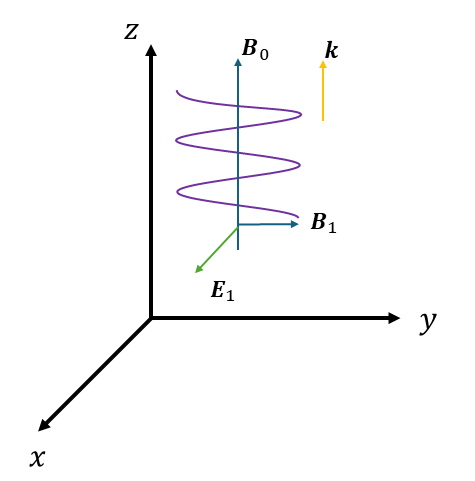
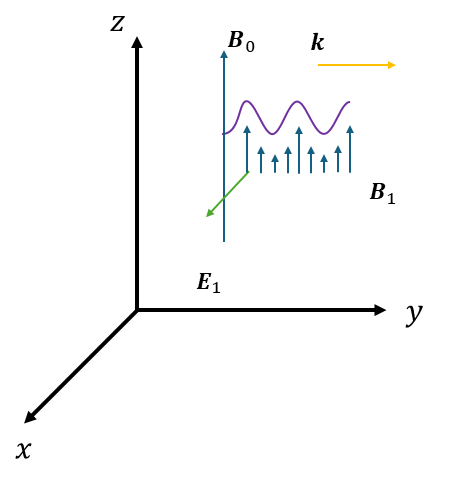

# 磁気流体波（Alfvén波、磁気音波）
**Alfvén**波はプラズマが磁力線とともに振動することによって生じる、電磁イオン波です。

Alfven波には伝播方向と背景磁場が垂直なquasi-perpな波（**Compressive Alfvén wave**、または**磁気音波**）と、伝搬方向と背景磁場が平行なquasi-parallelな波（**Shear Alfvén wave**、**シアAlfvén波**）があります。単にAlfvén波というと後者を指すことが多いです[^FFChen_book]。位相速度の違いから前者を速い波（**Fast mode**）と呼ぶこともある[^FFChen_book][^tanaka_book]。

## シアAlfvén波の導出
本節では、まずF.F.Chen[^FFChen_book]やNicholson[^Nicholson_book]に従って、磁場に平行に伝播する波を導出しましょう。波動の成分は下記の通り仮定します。

* $\bm{k}\parallel\bm{B}_0$
* $\bm{E}_1,\bm{j}_1 \perp \bm{B}_0$
* $\bm{B}_1, \bm{v}_1 \perp \bm{B}_0,\bm{E}_1$

そこで下記の通り座標系を取ります。

* x-direction: $\bm{E}_1,\bm{j}_1$
* y-direction: $\bm{B}_1, \bm{v}_1$
* z-direction: $\bm{k},\bm{B}_0$

したがって

* $\bm{k} = k \bm{e}_z$
* $\bm{B}_0 = B_0 \bm{e}_z$
* $\bm{E}_1 = E_x \bm{e}_x$
* $\bm{B}_1 = B_y \bm{e}_y$

とおきます。

<!-- ```{figure} images/xmode.png
:name: fig-soliton
:width: 100%

分散関係。赤矢印で示した範囲でのみ電磁波が伝播できる。
``` -->

<figure>

<figcaption>図2.1 座標の設定とシアAlfven波のイメージ</figcaption>
</figure>

さらに今は$\omega \ll \omega_c$と電子サイクロトロン運動よりも遅い低周波だけを考えます。ここが電磁波の場合との違いです。電子の運動は$\bm{E}_1\times\bm{B}_0$ドリフトのみを考えて $\bm{v}_e = v_{ey} \bm{e}_y$ とおきます。分極ドリフト速度は質量に比例するので、質量の小さい電子の$x$方向の分極ドリフトは無視できます。

まず、ファラデー則、アンペール則、電子とイオンそれぞれの運動方程式をFourier変換して

$$
    i\bm{k}\times\bm{E}_1 = \frac{i\omega}{c}\bm{B}_1　\tag{2.1}
$$

$$
    i\bm{k}\times\bm{B}_1 = \frac{4\pi}{c}n_0 e(\bm{v}_i-\bm{v}_e) 
        -\frac{i\omega}{c}\bm{E}_1
        \tag{2.2}
$$

$$
    0 = -en_0 \bm{E}_1 -\frac{en_0}{c}\bm{v}_e\times\bm{B}_0
    \tag{2.3}
$$

$$
    -i\omega m_i n_0 \bm{v}_i = en_0\bm{E}_1+\frac{en_0}{c}\bm{v}_i\times\bm{B}_0
    \tag{2.4}
$$

となります。まず(2.1)は$\bm{B}_1 = B_y \bm{e}_y$から$y$成分を比較して 

$$
    B_y = \frac{ck}{\omega}E_x \tag{2.5}
$$

を得ます。次に(2.2)の$x$成分を比較して(2.5)を適用すると

$$
    -\frac{ick^2}{\omega}E_x = \frac{4\pi}{c}n_0 e v_{ix} -\frac{i\omega}{c}E_x
    \tag{2.6}
$$

を得ます。次に(2.4)の$y$成分から

$$
    -i\omega m_i v_{iy} = -\frac{e}{c}v_{ix}B_0 \tag{2.7}
$$

を得ます。最後に(2.4)の$x$成分から

$$
    -i\omega m_i v_{ix} = eE_x +\frac{e}{c} B_0 v_{iy} \tag{2.8}
$$

を得ます。

(2.5)-(2.8)を解いていきます。まず(2.7)を$v_{iy}$について解くと

$$
    v_{iy} = \frac{eB_0}{ic\omega m_i} v_{ix} \tag{2.9}
$$

となります。ここでイオンサイクロトロン振動数が

$$
    \Omega_i = \frac{eB_0}{cm_i} \tag{2.10}
$$

で与えられることを使うと、(2.9)は

$$
    v_{iy} = -\frac{i\Omega_i}{\omega}v_{ix} \tag{2.11}
$$

となります。これを(2.8)に代入すると

$$
    v_{ix} = \frac{e/m_i}{i \Omega_i^2 /\omega-i\omega}E_x \tag{2.12}
$$

となります。これを(2.6)に代入して$E_x$の係数を比較すると、イオンのプラズマ振動数が

$$
    \omega_{pi} = \sqrt{\frac{4\pi n_0 e^2}{m_i}} \tag{2.13}
$$

であることを用いて、分散関係式

$$
    1-\frac{k^2 c^2}{\omega^2} +\frac{\omega_{pi}^2}{\Omega_i^2 -\omega^2} =0 \tag{2.14}
$$

を得ます。

ここで波はイオンのサイクロトロン周波数よりも遅い、すなわち$\omega \ll \Omega_i$という仮定を用いると、(2.14)は

$$
    1-\frac{k^2 c^2}{\omega^2} +\frac{\omega_{pi}^2}{\Omega_i^2} =0 \tag{2.15}
$$

となり、整理して

$$
    \omega^2 = \frac{k^2c^2}{1+\omega_{pi}^2/\Omega_i^2} \tag{2.16}
$$

となります。ここで分母に着目して

$$
    \frac{\omega_{pi}^2}{\Omega_i^2} = \frac{4\pi n_0 e^2}{m}\cdot\frac{c^2m_i^2}{e^2B_0^2} \\
    = \frac{4\pi n_0 m_i c^2}{B_0^2} \tag{2.17}
$$

となります。ここでAlfvén速度を

$$
    v_A \equiv \sqrt{\frac{B_0^2}{4 \pi n_0 m_i}} \tag{2.18}
$$

と定義すれば、(2.16)は最終的に

$$
    \omega^2 = \frac{k^2 v_A^2}{1+(v_A/c)^2} \tag{2.19}
$$

となります。$v_A/c \ll 1$を用いると、分散関係式

$$
    \omega^2 = k^2 v_A^2 \tag{2.20}    
$$

を得ます。

## 圧縮性Alfvén波の導出
次に磁場に垂直に伝播する波を考えましょう。下記の通り座標系を取ります。

* x-direction: $\bm{E}_1$
* y-direction: $\bm{k}$
* z-direction: $\bm{B}_0,\bm{B}_1$

したがって

* $\bm{k} = k \bm{e}_y$
* $\bm{B}_0 = B_0 \bm{e}_z$
* $\bm{E}_1 = E_x \bm{e}_x$
* $\bm{B}_1 = B_y \bm{e}_z$

とおきます。

<figure>

<figcaption>図3.1 座標の設定と圧縮性Alfvén波のイメージ</figcaption>
</figure>


シアAlfvén波と同様にファラデー則、アンペール則、イオンの運動方程式の方程式系を解いていきます。まずファラデー則から

$$
    B_y = -\frac{ck}{\omega}E_x \tag{3.1}
$$

を得ます。これをアンペール則に代入すると

$$
    -\frac{ick^2}{\omega}E_x = \frac{4\pi}{c}n_0 e v_{ix} -\frac{i\omega}{c}E_x
    \tag{3.2}
$$

となります。またイオンの運動方程式も

$$
    -i\omega m_i v_{iy} = -\frac{e}{c}v_{ix}B_0 \tag{3.3}
$$

$$
    -i\omega m_i v_{ix} = eE_x +\frac{e}{c} B_0 v_{iy} \tag{3.4}
$$

となり、つまり解くべき方程式系(3.2) - (3.4)は(2.6)-(2.8)とまったく同じになります。したがって同様の議論をすることで分散関係式が

$$
    \omega^2 = \frac{k^2 v_A^2}{1+(v_A/c)^2} \tag{3.5}
$$

となります。

## 磁気流体の理論からの導出
先の2節ではシアAlfvén波、圧縮性Alfvén波を別個に導出しましたが、田中、西川[^tanaka_book]に従って統一的に導出できることを示します。

再び電子（慣性を無視）とイオンの運動方程式を書くと

$$
    0 = -en_e\left(\bm{E}+\frac{v_e}{c}\times \bm{B}\right) \tag{4.1}
$$

$$
    m_i n_i \frac{d\bm{v}_i}{dt} = 
    en_i\left(\bm{E}+\frac{v_i}{c}\times \bm{B}\right) \tag{4.2}
$$

となります。非運動論的な範囲で準中性条件$n_i \sim n_e$を仮定し、電流の定義

$$
    \bm{J} \equiv e(n_i \bm{v_i} -n_e \bm{v_e}) \tag{4.3}
$$

を用いれば、(4.2)-(4.1)から理想磁気流体の運動方程式

$$
    m_i n_i \frac{d\bm{v}_i}{dt} = \frac{1}{c}\bm{J}\times\bm{B}  \tag{4.4}
$$

を得ます。さらにアンペール則、ファラデー則から

$$
    \nabla\times\bm{B}=\frac{4\pi}{c}\bm{J} \tag{4.5}
$$

$$
    \nabla\times\bm{E}=-\frac{1}{c}\frac{\partial \bm{B}}{\partial t} \tag{4.6}
$$

となります。(4.5)と(4.4)から$\bm{J}$を消去して磁気流体の運動方程式

$$
    m_i n_i \frac{d \bm{v}_i}{dt} 
    = \frac{1}{4\pi} (\bm{v}\times\bm{B})\times\bm{B} \tag{4.7}
$$

を得ます。また(4.2)と(4.6)から$\bm{E}$を消去して磁気流体の磁場の時間発展方程式

$$
    \frac{\partial \bm{B}}{\partial t} 
    = \nabla\times(\bm{v}_i\times\bm{B})
    -\frac{cm_i}{e}\nabla \times \frac{d\bm{v}_i}{dt} 
    \tag{4.8}
$$

を得ます。

ここで $\bm{v_i}=\bm{v_i1}$, $\bm{B}=\bm{B}_0 + \bm{B}_1$ と線形近似して(4.7)と(4.8)を解くと

$$
    m_i n_i \frac{d\bm{v}_{i1}}{dt} 
    = \frac{1}{4\pi}(\nabla \times \bm{B_1})\times{B_0}
    \tag{4.9}
$$

$$
    \frac{\partial \bm{B}_1}{\partial t} 
    = \nabla\times(\bm{v}_{i1} \times\bm{B}_0)
    -\frac{cm_i}{e}\nabla \times \frac{d\bm{v}_{i1}}{dt} 
    \tag{4.10}
$$

となります。さらにこれらをFourier変換すると

$$
   -m_i n_i \omega \bm{v_{i1}} = \frac{1}{4\pi}(\bm{k}\times\bm{B}_1)\times\bm{B}_0
   \tag{4.11}
$$

$$
    -\omega\bm{B}_1 
    = \nabla \times(\bm{v}_{i1}\times\bm{B}_0) 
    +\frac{i\omega cm_i}{e}(\bm{k}\times\bm{v}_{i1}) \tag{4.12}
$$

となります。(4.11)と(4.12)から$\bm{v_i}$を消去すると

$$
    \bm{B}_1 = \bm{k}\times\left(
        \left(
            \frac{(\bm{k}\times{B}_1)\times{B}_0}{4\pi m_i n_i \omega^2}
            \right)
        \times \bm{B}_0
        \right)
        +\frac{i\omega c m_i}{e} \left(
            \bm{k}\times\left(
                -\frac{(\bm{k}\times\bm{B}_1)\times\bm{B}_0}{4\pi m_i n_i \omega^2}
            \right)
        \right) \tag{4.13}
$$

となります。

ここで背景磁場$B_0$の向きにz軸を取り、波数ベクトルのそれに垂直な成分がx軸となるように座標系を取ります。磁場の揺動成分$\bm{B}_1$には方向性を仮定しません。すなわち

$$
    \bm{B}_0 = (0,0,B_0) \\
    \bm{B}_1 = (Bx, By, Bz) \\
    \bm{k} = ({k_{\parallel}}, 0, k_{\perp}) 
$$

とおきます。

(4.13)を少しずつ整理していきましょう。まずベクトル三重積の公式を使って内側から計算していくと

$$
    (\bm{k}\times{B}_1) \times \bm{B}_0 = 
    (\bm{k}\cdot\bm{B}_0) \bm{B}_1 - (\bm{B}_1\bm{B_0}) \bm{k} 
$$
$$
    ((\bm{k}\times{B}_1) \times \bm{B}_0) \times \bm{B}_0  
    = k_{\perp}B_0 \bm{B}_1 \times \bm{B}_0 -B_0 B_z \bm{k} \times \bm{B}_0
$$
$$
    \bm{k} \times (((\bm{k}\times{B}_1) \times \bm{B}_0) \times \bm{B}_0)
    = (k_{\parallel}B_0) \bm{k} \times (\bm{B}_1 \times \bm{B}_0) 
        - (B_0 B_z) \bm{k}\times(\bm{k} \times \bm{B}_0) \\
    = (k_{\parallel}B_0) ((\bm{k}\cdot\bm{B}_0)\bm{B}_1 - (\bm{k}\cdot\bm{B}_1)\bm{B}_0) 
        - B_0 B_z ((\bm{k}\cdot \bm{B}_0)\bm{k} -|k|^2 \bm{B}_0) \\
    = k_{\parallel}^2 B_0^2 \bm{B}_1 - k_{\parallel}B_0(k_{\perp}B_x - k_{\parallel}B_z)\bm{B}_0
        - k_{\parallel} B_0^2 B_z \bm{k} -((k_{\parallel}^2 + k_{\perp}^2) B_0 B_z \bm{B_0}
$$

となります。これを行列形式で書くと、特にz成分で$k_{\perp}B_0^2 B_z$の項が2組相殺されて

$$
\begin{bmatrix}
    k_{\parallel}^2 B_0^2 B_x -k_{\parallel}k_{\perp} B_0^2 B_z \\
    k_{\parallel}^2 B_0^2 B_y \\
    -k_{\parallel}k_{\perp}B_0^2 B_x-k_{\perp}^2 B_0^2 B_z
\end{bmatrix}
= B_0^2 \begin{bmatrix}
    k_{\parallel}^2  B_x -k_{\parallel}k_{\perp}  B_z \\
    k_{\parallel}^2 B_y \\
    -k_{\parallel}k_{\perp} B_x -k_{\perp}^2  B_z
\end{bmatrix}　\\
= B_0^2 \begin{bmatrix}
    k_{\parallel}^2 & 0 & -k_{\parallel}k_{\perp} \\
    0 & k_{\parallel}^2 & 0\\
    -k_{\parallel}k_{\perp} & 0 & -k_{\perp}^2 
\end{bmatrix} 
\begin{bmatrix}
B_x \\
B_y \\
B_z
\end{bmatrix}
$$

となります。くくりだした$B_0^2$とともに係数を整理すると、

$$
    \frac{\bm{B}_0^2}{4\pi m_i n_i \omega} = \frac{v_A^2}{\omega^2}
$$

ときれいな形になります。

次に第二項を計算する。第一項のために作った1つ目の結果が再利用できて

$$
    \bm{k}\times((\bm{k}\times{B}_1) \times \bm{B}_0)
    = (\bm{k}\cdot\bm{B}_0) \bm{k}\times\bm{B}_1\\
    = k_{\parallel}B_0 \bm{k}\times\bm{B}_1 \\
    = k_{\parallel}B_0
    \begin{bmatrix}
        -k_{\parallel}B_y \\
        k_{\parallel}B_x -k_{\perp}B_z \\
        k_{\perp}B_y
    \end{bmatrix} \\
    = k_{\parallel}B_0
    \begin{bmatrix}
        0 & -k_{\parallel} & 0\\
        k_{\parallel} & 0 &  -k_{\perp} \\
        0 & k_{\perp} & 0
    \end{bmatrix} 
    \begin{bmatrix}
        B_x \\
        B_y \\
        B_z
    \end{bmatrix}\\
$$

となります。係数は $B_0$だけを含めると、ここでは

$$
    \frac{i\omega c m_i B_0}{e} \frac{1}{4\pi m_i n_i \omega^2} 
    = \frac{cB_0}{4\pi n_i e\omega}
$$

となります。

以上を踏まえて(4.13)を整理しましょう。まず両辺を第一項の係数で割ると、第二項の係数は

$$
    \frac{cB_0}{4\pi n_i e\omega} \cdot \frac{\omega^2}{v_A^2} = \frac{cB_0}{4\pi n_i e\omega} \cdot \frac{4\pi n_i m_i \omega}{B_0^2}
    = \frac{\omega}{\Omega_i}
$$

となります。すべての項を左辺にまとめると、最終的には

$$
\begin{bmatrix}
    k_{\parallel}^2 -\frac{\omega^2}{v_A^2} & -i(\frac{\omega}{\Omega_{i}})k_{\parallel}^2 & -k_{\parallel}k_{\perp} \\
    i(\frac{\omega}{\Omega_{i}})k_{\parallel}^2 & k_{\parallel}^2 -\frac{\omega^2}{v_A^2} & -i(\frac{\omega}{\Omega_{i}})k_{\parallel}k_{\perp} \\
    -k_{\parallel}k_{\perp} & i(\frac{\omega}{\Omega_{i}})k_{\parallel}k_{\perp} & k_{\perp}^2 -\frac{\omega^2}{v_A^2}
\end{bmatrix}
\begin{bmatrix}
        B_x \\
        B_y \\
        B_z
\end{bmatrix} = \bm{0} \tag{4.14}
$$

となります。

ここで、今は低周波を考えていることを思い出しましょう。すなわち$\omega/\Omega_i \ll 1$だから、(4.13)の第二項、(4.14)のうちひし形の部分の項は無視できます。すると(4.14)は

$$
\begin{bmatrix}
    k_{\parallel}^2 -\frac{\omega^2}{v_A^2} & 0 & -k_{\parallel}k_{\perp} \\
    0 & k_{\parallel}^2 -\frac{\omega^2}{v_A^2} & 0 \\
    -k_{\parallel}k_{\perp} & 0 & k_{\perp}^2 -\frac{\omega^2}{v_A^2}
\end{bmatrix}
\begin{bmatrix}
        B_x \\
        B_y \\
        B_z
\end{bmatrix} = \bm{0} \tag{4.15}
$$

となります。

まず、y成分に着目すると、

$$
    k_{\parallel}^2 = \frac{\omega^2}{v_A^2} \tag{4.16}
$$

であり、これはシアAlfvén波の分散関係式(2.20)そのものです。

次にx,z成分を考えよう。背景磁場はz方向であることを考えると、$B_x\to B_{\perp}$, $B_{z}\to B_{\parallel}$と置き換えることが妥当と考えられる。それを用いると、磁場の各成分は

$$
    B_{\parallel} = \frac{1}{k_{\parallel}k_{\perp}}\left(k_{\parallel}^2-\frac{\omega^2}{v_A^2}\right) B_{\perp} \tag{4.17}
$$

$$
    B_{\perp} = \frac{1}{k_{\parallel}k_{\perp}}\left(k_{\perp}^2-\frac{\omega^2}{v_A^2}\right) B_{\parallel} \tag{4.18}
$$

で結び付けられることがわかります。

(4.14)の行列式をゼロとすることで固有モードが定まります。実際に計算してみると

$$
    \mathrm{det} = \left(k_{\parallel}^2 -\frac{\omega^2}{v_A^2}\right)^2 
        \left(k_{\perp}^2 -\frac{\omega^2}{v_A^2} \right) \\
        - \left(\frac{\omega}{\Omega_{i}}\right)^2 k_{\parallel}^2 k_{\perp}^2 \left(k_{\parallel}^2 -\frac{\omega^2}{v_A^2}\right)
        - \left(\frac{\omega}{\Omega_{i}}\right)^2 k_{\parallel}^4 \left(k_{\parallel}^2 -\frac{\omega^2}{v_A^2}\right)
        +\left(\frac{\omega}{\Omega_{i}}\right)^2 k_{\parallel}^4 k_{\perp}^2 
        +\left(\frac{\omega}{\Omega_{i}}\right)^2 k_{\parallel}^4 k_{\perp}^2 \\ 
        -k_{\parallel}^2 k_{\perp}^2 \left(k_{\perp}^2 -\frac{\omega^2}{v_A^2}\right) \\

    = \left(k_{\parallel}^2 -\frac{\omega^2}{v_A^2}\right)^2 
        \left(k_{\perp}^2 -\frac{\omega^2}{v_A^2} \right) -k_{\parallel}^2 k_{\perp}^2 \left(k_{\perp}^2 -\frac{\omega^2}{v_A^2}\right) \\
        - \left(\frac{\omega}{\Omega_{i}}\right)^2 k_{\parallel}^2 k_{\perp}^2 \left(k_{\parallel}^2 -\frac{\omega^2}{v_A^2}\right)
        - \left(\frac{\omega}{\Omega_{i}}\right)^2 k_{\parallel}^4 \left(k_{\parallel}^2 -\frac{\omega^2}{v_A^2}\right)
        +\left(\frac{\omega}{\Omega_{i}}\right)^2 k_{\parallel}^4 k_{\perp}^2 
        +\left(\frac{\omega}{\Omega_{i}}\right)^2 k_{\parallel}^4 k_{\perp}^2 \\
$$

となります。2つめのカッコで前半2つの項を$(k_{\parallel}^2-\omega^2/v_A^2)$でくくり、残りの項を$(\omega/\Omega_i)^2$でくくって、最後に$-(\omega^2/v_A^2)$で割って整理すれば、最終的に方程式$\mathrm{det}=0$は

$$
    \left(k_{\parallel}^2 -\frac{\omega^2}{v_A^2}\right) \left(|k|^2 -\frac{\omega^2}{v_A^2} \right)
    -\left(\frac{\omega}{\Omega_{i}}\right)^2 k_{\parallel}^2 |k|^2 = 0 \tag{4.19}
$$

となります。これが2つの磁気流体波を統一的に示す分散関係式となります。


<!--
$$
    \mathrm{det}\begin{bmatrix}
    k_{\parallel}^2 -\frac{\omega^2}{v_A^2} & 0 & -k_{\parallel}k_{\perp} \\
    0 & k_{\parallel}^2 -\frac{\omega^2}{v_A^2} & 0 \\
    -k_{\parallel}k_{\perp} & 0 & k_{\perp}^2 -\frac{\omega^2}{v_A^2}
\end{bmatrix} 
= \left(k_{\parallel}^2 -\frac{\omega^2}{v_A^2}\right)^2
    \left(k_{\perp}^2 -\frac{\omega^2}{v_A^2}\right) 
    -k_{\parallel}^2 k_{\perp}^2 \left(k_{\parallel}^2 -\frac{\omega^2}{v_A^2}\right) \\
= -\left(k_{\parallel}^2 -\frac{\omega^2}{v_A^2}\right)\left(|k|^2 -\frac{\omega^2}{v_A^2}\right)\left(\frac{\omega^2}{v_A^2}\right) = 0
$$

となる。 -->


## 参考文献
[^FFChen_book]: F. F. Chen, "Introduction to plasma physics and controlled fusion", p126 <br>https://kuline.kulib.kyoto-u.ac.jp/opac/opac_link/bibid/BB05126827 
[^Nicholson_book]: 7 Fluid Equation. Introduction to plasma theory. D. R. Nicholson. Wiley. 1983. <br> https://kuline.kulib.kyoto-u.ac.jp/opac/opac_link/bibid/TY86003156
[^tanaka_book]: 7.4 アルヴェン波， 磁気音波. 高温プラズマの物理学. 田中基彦, 西川恭治. 丸善. 1991. <br>
https://doi.org/10.11501/13628007